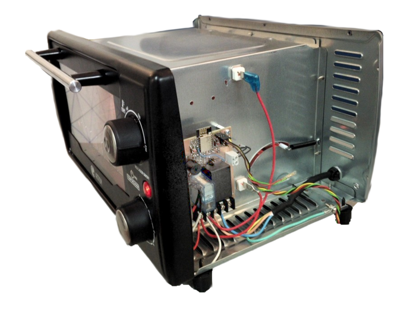
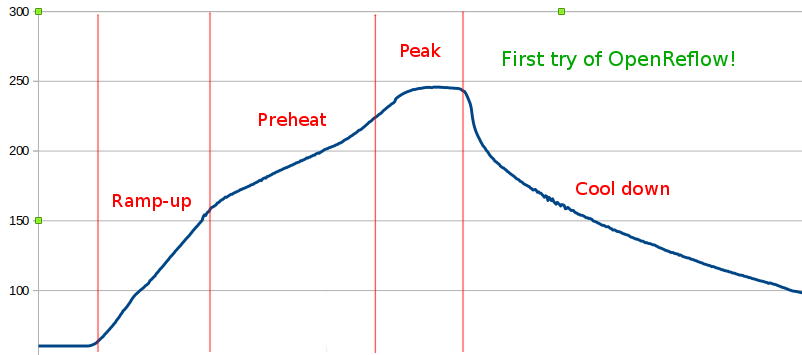
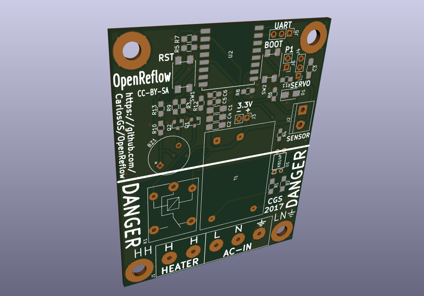
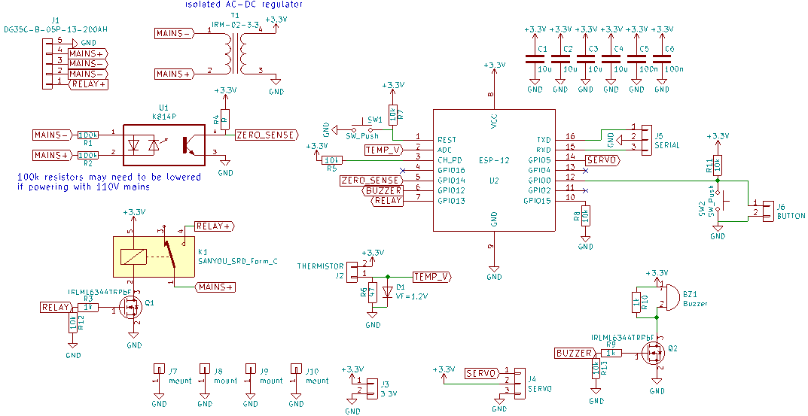

# OpenReflow
Simple reflow oven controller based on ESP8266

# NOT RECOMMENDED FOR NEW BUILDS!

Please note that for the temperature sensor, I used a voltage divider to read a PT100 element. This makes it necessary to manually calibrate, and even then it wouldn't be as accurate as using a proper RTC reading chip (i.e. MAX31865).

Also the "zero crossing" detector wasn't really necessary for the small wattage and slow pulses involved (at most 1500W at 1Hz). It just adds complexity and makes the board more dangerous by mixing digital and live tracks.

In the end I think it would be more simple to just flash a standard Sonoff switch and wire an external temperature sensor module.

# More information can be found in PCBway

<https://www.pcbway.com/project/shareproject/OpenReflow.html>

# License

Software is GPLv3, Hardware (PCB) is CC-BY-SA.

Author: Carlos Garcia Saura (@CarlosGS)
